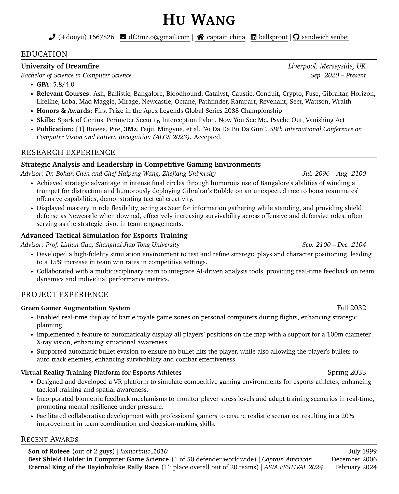

# CS LaTeX CV Template

An optimized LaTeX CV template tailored for Computer Science students aiming at applications and research roles. This template is designed to highlight the technical and academic achievements of Computer Science majors, making it suitable for both academic and industry job applications.

## Screenshot

## Acknowledgements
Special thanks to Shengyuan Lu for the foundational template, and to Hu Wang Player, also known as Df 3Mz, for being an inspirational figure. Holding dreams in my heart and fire in my gut.
